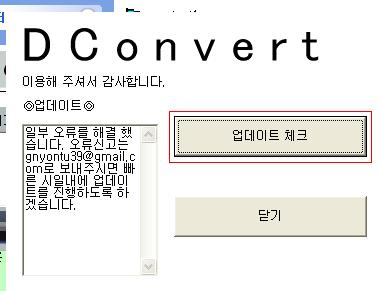
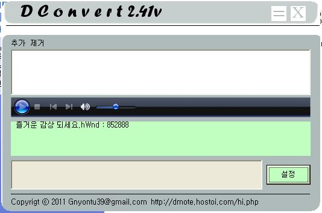

# Dconvert
Dconvert

- [다운로드](./build/DConvert_x86_0.0.1.zip?raw=true)

## 설치
설치는 간단하다. 아직 완성단계가 아니기 때문에 인스톨 파일을 만들지 않았기 때문에 ZIP 압축 형식으로 배포가 되고 있다.

- 알집을 최신 버전으로 업데이트를 한 뒤 DConvert.zip를 더블 클릭하여 압축풀기를 통해 설치를 한다. (경로는 사용자 마음대로 해도 상관이 없습니다.)

    - 실행
        - 실행하는 방법은 인스톨 과정 없이 하기 때문에 처음하는 분들은 실행파일을 찾기가 힘들 것이다.

        - 1.압축 해제한 폴더로 이동합니다.
        - 2."DConvert.exe"를 더블 클릭하여 실행한다.

    - 업데이트
        - 본 버전에서는 자동 업데이트 기능을 제공하나, 개인 서버 문제로 인해 자동업데이트를 이용할 수 없게 되었습니다. 하지만, 최신 버전이 나왔는 지는 확인이 가능합니다. 확인 방법에는 2가지가 있습니다.

        

        - "DCovert.exe"를 실행하여 업데이트 체크 버튼을 클릭합니다.
            - 진행 절차를 따라 업데이트 확인을 합니다.

        - 압축을 해제한 폴더에는 “UPDAYT.EXE"파일이 있습니다. 해당 파일을 더블 클릭하여 체크를 합니다.

    - 제거
        - 업데이트를 통해 인스톨 파일이 만들어지지 않는 한 사용자가 직접 제거를 해야만 제거가 됩니다. 본 프로그램은 별도로 다른 폴더, 또는 위치에 파일을 생성하지 않기 때문에 압축 해제한 폴더만 삭제를 해도 완전 삭제가 됩니다. 약간의 찌꺼기가 남을 수 있으니, 쿠키를 제거하는 것도 좋은 방법이다.

        - 압축 해제한 상위폴더로 이동합니다.
        - 압축해제한 폴더를 제거합니다.

## 특징 및 기능

- Tray Mode
    - 이 모드를 통해 사용자는 부피가 큰 이 프로그램을 사라지게 할 수 있습니다. 그로인해 다른 창을 더 띄울 수 있도록 도와줍니다. 자동으로 노래가 재생이 되면 노래의 상태, 이름 등을 Tray 상태에서 계속 정보를 알려줍니다. 이 기능은 설정 버튼이 생기면 사용자가 선택을 통해 사용할 것인지 안할 것인지 선택할 수 있도록 할 예정입니다.

    

- Player
    - 본 기능은 본 프로그램의 중심이 되는 기능입니다. 이 기능을 사용하기 위해서는 윈도우 미디어 플레이어가 설치가 되어 있어야 하며, 웹서버에 있는 노래도 재생이 가능합니다.

    - List
        - 사용자가 여러 노래를 들을 수 있도록 도와 줍니다.

- 버튼 설명
    - 이 프로그램을 처음 사용자에게는 처음 보는 버튼들이 있습니다. 이 프로그램에서는 직접 이미지, 버튼 그림을 모두 제작을 하기 때문에 다른 형태를 지니고 있습니다.

    - 종료 버튼
        - 프로그램을 종료할 때 3가지의 방법이 있습니다.

        - 프로그램을 보시면 위에 부분에 네모 안에 X가 있습니다. 그 버튼을 클릭하시면 종료가 됩니다.

            

        - Tray를 마우스 반대쪽을 클릭하신 뒤 종료 버튼을 누르시면 됩니다.

            

        - Ctrl+Alt+Delete를 순서대로 입력하시면 작업관리자가 뜨게 되며, 작업끝내기를 통해 종료 하실 수 있습니다. (Windows Xp 기준)

    - Tray 버튼
        - 본 프로그램을 실행하게 되면 자동으로 Tray도 실행하게 됩니다.(업데이트시 수정 예정)
        - 옆에 = X가 차례대로 있는데, =가 Tray모드입니다. 클릭하게 되면 완전히 Tray상태가 됩니다.
        - Tray상태에서 Tray를 클릭하게 되면, 원래대로 돌아오게 되며, 마우스 반대쪽을 클릭하여 보이게 할 수도 있습니다.

            

## 주의사항

- 업데이트

    - 갑작스런 서버 장애로 인해 자동 업데이트 기능이 사용이 불가능 해졌습니다.
    - 수동으로 업데이트를 하셔야 하며, 현제는 무조권 업데이트를 권하기 때문에 무시해주시길 바람니다. ex)최신버전 :1.1 현제버전 : 1.0 만약 최신버전이 2.2 이상일 경우 수동 업데이트를 하셔야 합니다.

    - 추가, 노래재생
        - 추가는 윈도우 미디어 플레이어를 기준으로 확장명을 불러 올 수 있으며, 영상, 음원 구별 하지 않지만 동영상은 소리만 들리게 됩니다.

    - 기타
        - 리스트가 있어도 반복 듣기나, 순서대로 듣기가 되지 않습니다. 무조권 한곡만 재생이 되며, 노래가 끝나면 사용자가 직접	 노래를 바꾸어야 합니다.

## 제작자
- 수동 업데이트는 http://blog.naver.com/cyydo96 에서 할 수 있으며, 6월 20일 부터는 http://dmote.hostoi.com/ 에서 해야 합니다.
- 오류나, 추가해야할 점은 gnyontu39@gmail.com 으로 보내주시면 감사하겠습니다.