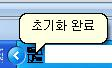

# Dconvert

## Download

- [Windows x64 zip file](./build/DConvert_x86_2.4.1.zip?raw=true)

## Info

- 웹 링크로 되어있는 음악이나 음악 파일을 재생합니다.
- 작업표시줄에 작은 아이콘으로 숨길 수도 있습니다.
  - 노래의 상태, 이름 등을 말풍선 형태로 표시해줍니다.
  
  

- UI
  
  

  - UI는 이렇게 못생겼습니다.
  - 종료하는 방법은 다음과 같은 총 3가지 방법이 있습니다.
    - 우측 상단에 X버튼을 통해 종료합니다.
    - 작업표시줄의 아이콘에서는 우클릭 후 닫기 버튼을 누르면 됩니다.
        
    - 작업관리자로 강제 종료도 가능합니다.

  - 작업표시줄에 표시하기 버튼
    - 프로그램 실행시 자동으로 작업표시줄에 아이콘 형태로 표시됩니다.
    - 프로그램의 우측 상단으 `=`버튼을 누르면 창이 숨겨지게 됩니다.

## System Requirements

- Windows XP 이상
- Windows Media Player 9 이상
- 인터넷 연결 필수

## How to Install

- [DConvert_x86.zip](./build/DConvert_x86_2.4.1.zip?raw=true) 파일을 다운로드 합니다.
- 압축을 해제 합니다.
- `DConvert.exe` 파일을 더블 클릭합니다.

## How to Update

- 자동 업데이트 기능을 제공하고 있습니다. 현재 서버 상의 문제로 자동업데이트가 불가합니다. [여기](https://blog.naver.com/cyydo96)에서 최신 버전을 확인할 수 있습니다.
- 다음과 같은 방법으로 업데이트가 존재하는지 확인할 수 있습니다.
  - 프로그램 상의 `업데이트 체크`버튼을 눌러 확인합니다.
  
    

  - `UPDATE.EXE` 파일을 더블 클릭합니다.

## How to Delete

- 별도의 Uninstall 파일을 제공하지 않으며, 프로그램은 폴더 내에만 별도의 파일을 생성하거나 삭제하므로 폴더를 제거합니다.
- 추가적으로 인터넷 접속을 사용하기 때문에 쿠기 제거를 하시면 완전삭제가 가능합니다.

## What did you learn?

- VB 언어를 공부하면서 만들어본 프로젝트입니다.
- VB 언어로 작업표시줄 아이콘으로 표시하는 부분을 배울 수 있었습니다.
- 윈도우 미디어 플레이어를 가져다 사용하는 부분과 한계를 알 수 있었습니다.
- 웹 서버와 연동하여 업데이트하는 방법을 구상할 수 있었습니다.
- 직접 디자인을 시도하면서 폼을 깍는 방법 등 다양한 방법을 시도해볼 수 있었습니다.

## Finally

- 2011년 이후 업데이트가 없습니다. 서버는 다운되었습니다.
  - 호스팅하던 서버가 죽었고 다시 복구했을 때에는 도메인 및 IP가 변경되어 프로그램과 연동되지 않습니다.
- Update를 Updayt로 표기되어 있습니다. 이는 영어를 잘 모르는 사람이 만들어서 그렇습니다.
- 프로젝트를 다듬고 VB.NET이나 C#으로 재구성을 해볼 생각입니다.
- 참고 한 도서
  - (2010)비주얼 베이직 6 - (주)사이버출판사

## Modify Content

- 2011.04.12 ( 2.41 )
  - 프로젝트 기능 구현 완료

## Copyright

- 비상업적 용도로 사용 가능하며 링크를 반드시 포함해주세요.
- 문제가 되는 내용이 있다면 언제든지 [`issue`](https://github.com/Sotaneum/Dconvert/issues/new), [`Pull requests`](https://github.com/Sotaneum/Dconvert/compare) 부탁드립니다.